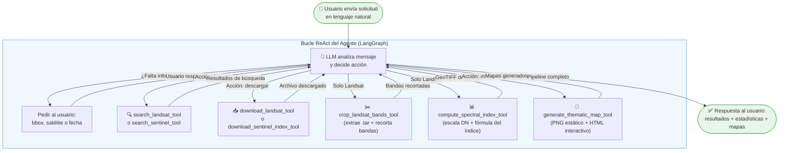
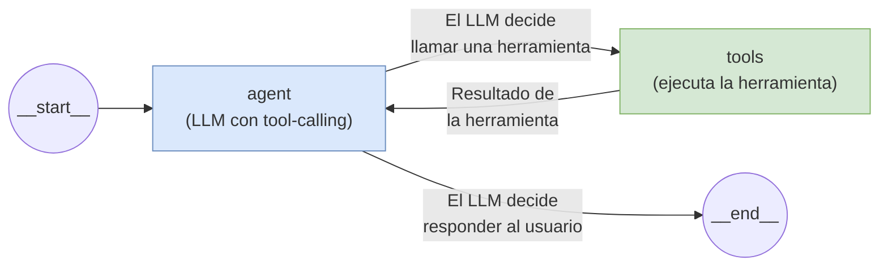
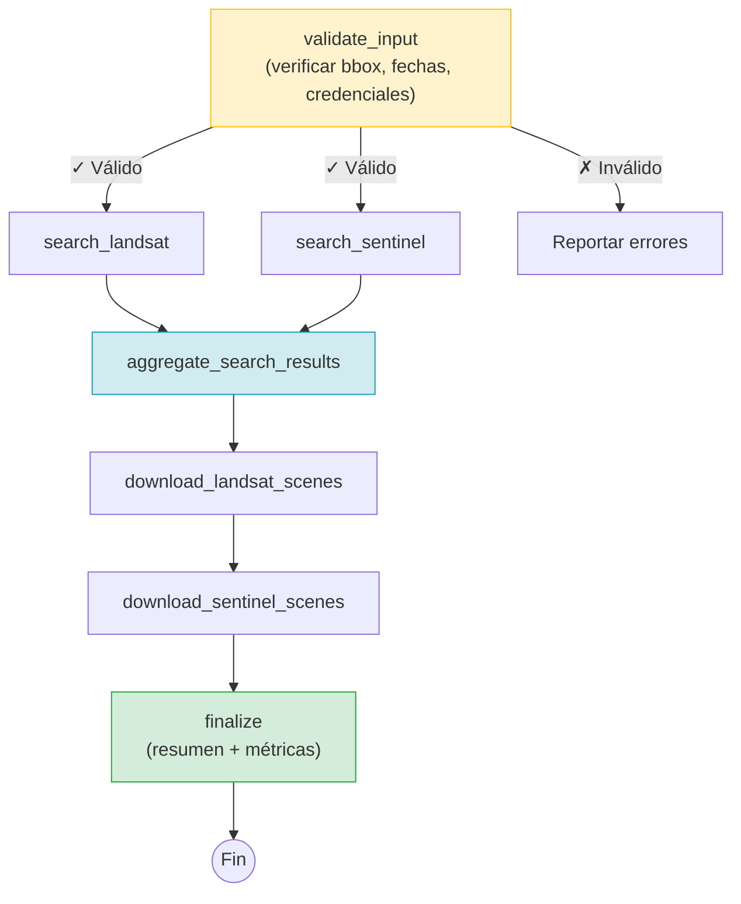
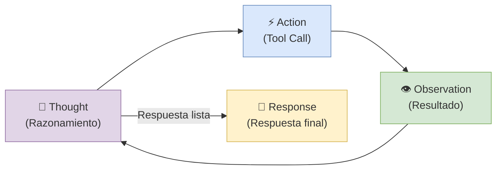
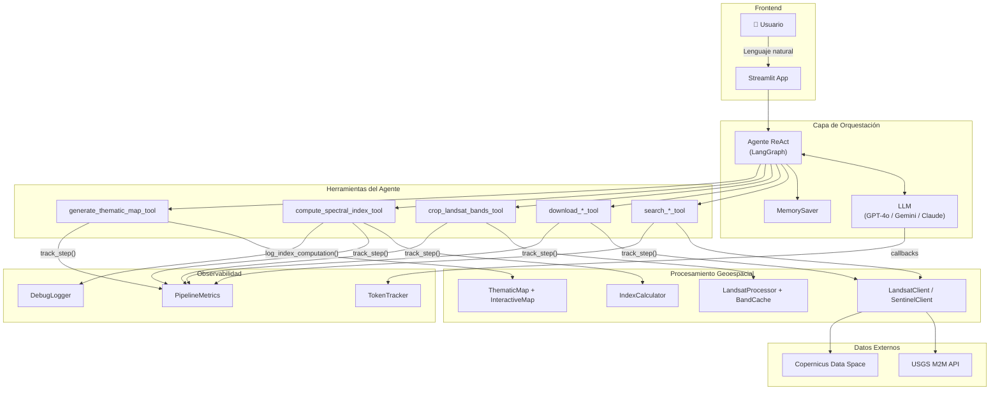
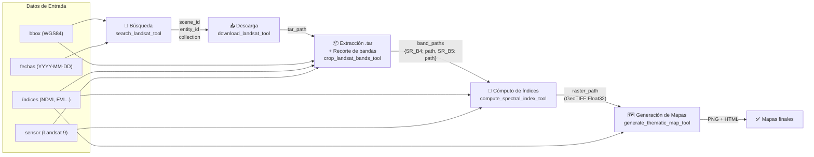
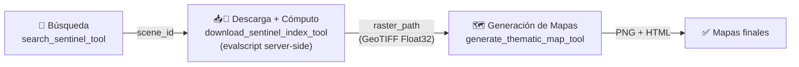
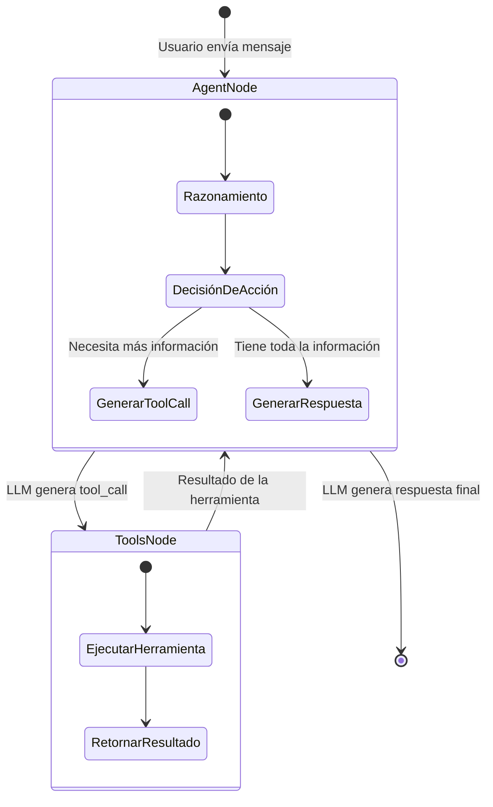
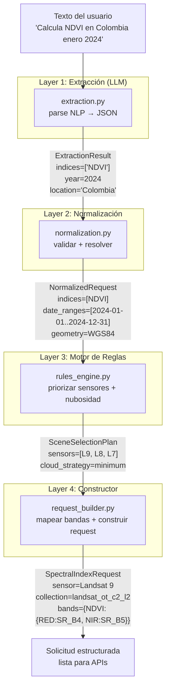

# Documentación Técnica: Arquitectura del Pipeline y Agente de Índices Espectrales

> **Proyecto de Tesis de Maestría** — Maestría en Ingeniería Analítica, Universidad Nacional de Colombia, sede Medellín.
>
> Este documento describe de forma exhaustiva la arquitectura del sistema, el pipeline de procesamiento, el diseño del agente y las decisiones de ingeniería detrás del *Spectral Index Agent*.

---

## Tabla de Contenidos

1. [Introducción](#1-introducción)
2. [Arquitectura General del Sistema](#2-arquitectura-general-del-sistema)
3. [Descripción General del Pipeline](#3-descripción-general-del-pipeline)
4. [Flujo de Ejecución Paso a Paso](#4-flujo-de-ejecución-paso-a-paso)
5. [Uso de Grafos con LangGraph](#5-uso-de-grafos-con-langgraph)
6. [Herramientas de LangChain Utilizadas](#6-herramientas-de-langchain-utilizadas)
7. [Tipo de Agente Implementado](#7-tipo-de-agente-implementado)
8. [Explicación Detallada del Código](#8-explicación-detallada-del-código)
9. [Decisiones de Diseño de la Arquitectura](#9-decisiones-de-diseño-de-la-arquitectura)
10. [Representación del Pipeline](#10-representación-del-pipeline)
11. [Conclusión](#11-conclusión)

---

## 1. Introducción

### 1.1 Propósito General del Sistema

El **Spectral Index Agent** es un agente de inteligencia artificial diseñado para automatizar flujos de trabajo completos de análisis geoespacial mediante lenguaje natural. El sistema permite a un usuario —sin necesidad de escribir código— solicitar tareas como:

- *"Calcula el NDVI para el área de Colombia en enero de 2024 usando Landsat 9"*
- *"Descarga imágenes Sentinel-2 y genera un mapa de NDWI"*

El agente interpreta la solicitud, busca imágenes satelitales, las descarga, recorta las bandas relevantes, computa índices espectrales (NDVI, EVI, SAVI, NDWI, NBR, NDBI) y genera mapas temáticos de calidad publicable, todo de forma autónoma y en un solo turno de conversación.

### 1.2 Problema que Busca Resolver

El análisis de imágenes satelitales para el cálculo de índices espectrales tradicionalmente requiere:

1. **Conocimiento técnico especializado**: manejar APIs de proveedores satelitales (USGS M2M, Copernicus), entender formatos de datos geoespaciales (GeoTIFF, shapefiles), y conocer las fórmulas de cada índice espectral.
2. **Múltiples herramientas desconectadas**: scripts de Python, software GIS (QGIS/ArcGIS), visualizadores web.
3. **Proceso manual y repetitivo**: cada paso (búsqueda, descarga, recorte, cálculo, visualización) debe ejecutarse secuencialmente con intervención humana.
4. **Alto riesgo de errores**: seleccionar bandas incorrectas según el sensor, no aplicar factores de escala apropiados, errores en sistemas de coordenadas.

El Spectral Index Agent elimina estas barreras al encapsular todo el flujo técnico detrás de una interfaz conversacional guiada por un LLM (Large Language Model).

### 1.3 Rol del Pipeline dentro de la Arquitectura

El pipeline es el **motor de procesamiento de datos** del sistema. Define las etapas concretas de transformación que convierten una solicitud de lenguaje natural en productos geoespaciales finales (GeoTIFFs e imágenes). El pipeline tiene dos manifestaciones en la arquitectura:

1. **Pipeline de extracción NLP** (módulo `pipeline/`): transforma texto libre → solicitud estructurada a través de 4 capas de procesamiento (extracción, normalización, reglas, construcción de solicitud).
2. **Pipeline de ejecución de herramientas**: orquestado por el agente LLM, ejecuta las operaciones geoespaciales reales (búsqueda → descarga → recorte → cómputo → visualización).

### 1.4 Rol de los Agentes dentro del Sistema

El agente es el **orquestador inteligente** que decide qué herramientas invocar, en qué orden, y con qué parámetros. Utiliza un LLM (GPT-4o, Gemini 2.5 Flash o Claude) con el patrón ReAct (Reasoning + Acting) para:

- Interpretar la intención del usuario en lenguaje natural
- Seleccionar y ejecutar herramientas en la secuencia correcta
- Manejar errores y reintentar con alternativas
- Mantener contexto conversacional entre turnos
- Responder al usuario con resultados, estadísticas y mapas generados

---

## 2. Arquitectura General del Sistema

### 2.1 Componentes Principales

El sistema está compuesto por siete capas arquitectónicas principales:

| Capa | Módulo | Responsabilidad |
|------|--------|-----------------|
| **Interfaz de Usuario** | `app/` | Aplicación Streamlit con chat conversacional, visualización de mapas y panel lateral |
| **Agente Orquestador** | `agents/`, `graphs/` | Agente ReAct basado en LangGraph que interpreta consultas y orquesta herramientas |
| **Herramientas (Tools)** | `tools/` | Funciones ejecutables por el agente: búsqueda, descarga, recorte, cómputo, mapas |
| **Pipeline NLP** | `pipeline/` | Extracción estructurada de solicitudes desde lenguaje natural |
| **Esquemas de Datos** | `schemas/` | Modelos Pydantic que definen la estructura de datos en cada etapa |
| **Configuración** | `config/` | Gestión centralizada de credenciales, rutas y parámetros vía `pydantic-settings` |
| **Observabilidad** | `tracking/` | Métricas de pipeline, costos de tokens LLM, y logs de depuración |

### 2.2 Diagrama de Arquitectura General

```mermaid
graph TB
    subgraph "Capa de Presentación"
        UI["🖥️ Streamlit App<br/>(app/main.py)"]
        CHAT["💬 Chat Component<br/>(app/components/chat.py)"]
        MAP["🗺️ Map Display<br/>(app/components/map_display.py)"]
        SIDEBAR["⚙️ Sidebar<br/>(app/components/sidebar.py)"]
    end

    subgraph "Capa de Orquestación (LangGraph)"
        AGENT["🤖 Agente ReAct<br/>(graphs/agent_graph.py)"]
        LLM["🧠 LLM<br/>(GPT-4o / Gemini / Claude)"]
        MEMORY["💾 MemorySaver<br/>(Checkpointer)"]
        SESSION["📋 SessionStore<br/>(memory/session_store.py)"]
    end

    subgraph "Capa de Herramientas (LangChain Tools)"
        SEARCH_L["🔍 search_landsat_tool"]
        SEARCH_S["🔍 search_sentinel_tool"]
        DOWNLOAD_L["📥 download_landsat_tool"]
        DOWNLOAD_S["📥 download_sentinel_index_tool"]
        CROP["✂️ crop_landsat_bands_tool"]
        COMPUTE["📊 compute_spectral_index_tool"]
        MAPGEN["🎨 generate_thematic_map_tool"]
        CACHE["📦 list_cached_bands_tool"]
        INDEX_LIST["📋 list_available_indices_tool"]
    end

    subgraph "Capa de Procesamiento Geoespacial"
        LANDSAT_CLIENT["USGS M2M Client<br/>(ingestion/landsat.py)"]
        SENTINEL_CLIENT["Copernicus Client<br/>(ingestion/sentinel.py)"]
        PROCESSOR["LandsatProcessor<br/>(raster/landsat_processor.py)"]
        CALC["IndexCalculator<br/>(raster/index_calculator.py)"]
        BAND_CACHE["BandCache<br/>(raster/band_cache.py)"]
        STATIC_MAP["ThematicMap<br/>(visualization/thematic_map.py)"]
        INTERACTIVE_MAP["InteractiveMap<br/>(visualization/interactive_map.py)"]
    end

    subgraph "APIs Externas"
        USGS["USGS M2M API<br/>(Landsat 4-9)"]
        COPERNICUS["Copernicus Data Space<br/>(Sentinel-2)"]
    end

    subgraph "Capa de Observabilidad"
        METRICS["PipelineMetrics<br/>(tracking/metrics.py)"]
        TOKENS["TokenTracker<br/>(tracking/token_tracker.py)"]
        DEBUG["DebugLogger<br/>(tracking/debug_log.py)"]
        CALLBACKS["CostTrackingHandler<br/>(tracking/callbacks.py)"]
    end

    UI --> CHAT & MAP & SIDEBAR
    CHAT --> AGENT
    AGENT <-->|"Razonamiento"| LLM
    AGENT -->|"Persistencia de estado"| MEMORY
    AGENT -->|"Artefactos de sesión"| SESSION

    AGENT -->|"Tool call"| SEARCH_L & SEARCH_S & DOWNLOAD_L & DOWNLOAD_S & CROP & COMPUTE & MAPGEN

    SEARCH_L --> LANDSAT_CLIENT --> USGS
    SEARCH_S --> SENTINEL_CLIENT --> COPERNICUS
    DOWNLOAD_L --> LANDSAT_CLIENT
    DOWNLOAD_S --> SENTINEL_CLIENT
    CROP --> PROCESSOR --> BAND_CACHE
    COMPUTE --> CALC
    MAPGEN --> STATIC_MAP & INTERACTIVE_MAP

    LLM -->|"on_llm_end"| CALLBACKS --> TOKENS
    SEARCH_L & DOWNLOAD_L & CROP & COMPUTE & MAPGEN -->|"track_step()"| METRICS
    COMPUTE -->|"log_index_computation()"| DEBUG
```



### 2.3 Flujo General de Información

El flujo de información sigue una trayectoria de arriba hacia abajo con retroalimentación:

1. **Entrada**: El usuario escribe una solicitud en lenguaje natural a través de la interfaz Streamlit.
2. **Interpretación**: El agente LLM analiza la solicitud y determina qué herramientas invocar.
3. **Ejecución**: Las herramientas se ejecutan secuencialmente, cada una transformando datos y produciendo artefactos.
4. **Retroalimentación**: Los resultados de cada herramienta regresan al LLM, que decide el siguiente paso.
5. **Salida**: El agente genera una respuesta final con los resultados, estadísticas y rutas a los mapas producidos.

### 2.4 Relación entre LangChain, LangGraph y el Agente

- **LangChain** proporciona las abstracciones fundamentales:
  - `BaseChatModel`: interfaz unificada para LLMs (OpenAI, Anthropic)
  - `@tool`: decorador para definir herramientas invocables por el agente
  - `BaseCallbackHandler`: hooks para observabilidad de llamadas LLM
  - `RunnableConfig`: inyección de configuración en herramientas
  
- **LangGraph** construye sobre LangChain añadiendo:
  - `create_react_agent()`: grafo preconfigurado con el bucle ReAct
  - `MemorySaver`: persistencia de historial de conversación entre turnos
  - `StateGraph`: grafos de estado personalizables (para el pipeline de ingestión)
  - `CompiledGraph`: grafo compilado y listo para ejecutar

- **El Agente** es el producto final: una instancia de `CompiledGraph` que combina el LLM, las herramientas y la memoria en un sistema cohesivo.

---

## 3. Descripción General del Pipeline

El sistema implementa dos pipelines complementarios que trabajan en conjunto.

### 3.1 Pipeline de Extracción NLP (módulo `pipeline/`)

Este pipeline transforma una solicitud en lenguaje natural en una solicitud estructurada lista para las APIs. Se compone de 4 capas secuenciales:

#### Capa 1: Extracción (`pipeline/extraction.py`)

- **Entrada**: Texto libre del usuario (ej: *"Calcula NDVI y NDWI en Colombia enero 2024"*)
- **Proceso**: El LLM con salida estructurada parse el texto y extrae campos específicos
- **Salida**: `ExtractionResult` — un modelo Pydantic con campos como `indices`, `location_description`, `geometry`, `start_date`, `end_date`, `year`, `sensor_requested`, `cloud_cover_max`

#### Capa 2: Normalización (`pipeline/normalization.py`)

- **Entrada**: `ExtractionResult` de la capa anterior
- **Proceso**: 
  - Valida los nombres de índices contra el catálogo soportado (`NDVI`, `EVI`, `SAVI`, `NDWI`, `NBR`, `NDBI`)
  - Resuelve expresiones temporales a rangos de fechas concretos (ej: `year=2024` → `DateRange(2024-01-01, 2024-12-31)`)
  - Lee y reproyecta geometrías desde archivos (KML, Shapefile, GeoJSON) a WGS84
  - Valida el sensor solicitado contra la enumeración `LandsatSensor`
- **Salida**: `NormalizedRequest` — solicitud completamente validada con índices tipados, rangos de fechas, y geometría en WGS84

#### Capa 3: Motor de Reglas (`pipeline/rules_engine.py`)

- **Entrada**: `NormalizedRequest`
- **Proceso**: Aplica reglas de negocio:
  - **Prioridad de sensores**: Landsat 9 > 8 > 7 > 5 > 4, filtrado por ventana operativa
  - **Estrategia de nubosidad**: mínima disponible o umbral especificado por el usuario
  - **Detección de múltiples tiles**: si la geometría abarca más de ~185 km necesita múltiples escenas
  - **Validación de ventana temporal**: verifica que el sensor estuvo operativo en las fechas solicitadas
- **Salida**: `SceneSelectionPlan` — un plan de selección por rango de fechas con sensores priorizados y reglas aplicadas

#### Capa 4: Constructor de Solicitud (`pipeline/request_builder.py`)

- **Entrada**: `SceneSelectionPlan` + `NormalizedRequest`
- **Proceso**: 
  - Selecciona el sensor primario (primero en la lista de prioridades)
  - Resuelve el mapeo de bandas concretas según el sensor (ej: `NDVI` en Landsat 8/9 → `SR_B4` (RED) + `SR_B5` (NIR); en Landsat 4-7 → `SR_B3` + `SR_B4`)
  - Construye la geometría en formato dict
- **Salida**: `SpectralIndexRequest` — solicitud final con todos los parámetros necesarios para ejecutar la búsqueda y descarga

### 3.2 Pipeline de Ejecución de Herramientas (orquestado por el agente)

Este es el pipeline operativo que ejecuta las acciones geoespaciales reales:

| Paso | Herramienta | Entrada | Salida |
|------|-------------|---------|--------|
| 1. Búsqueda | `search_landsat_tool` / `search_sentinel_tool` | bbox, fechas, nubosidad máxima | Lista de escenas disponibles con metadatos |
| 2. Descarga | `download_landsat_tool` / `download_sentinel_index_tool` | scene_id, entity_id, collection | Archivo .tar (Landsat) o GeoTIFF procesado (Sentinel) |
| 3. Recorte | `crop_landsat_bands_tool` | tar_path, índices, sensor, bbox | Bandas individuales recortadas como GeoTIFF |
| 4. Cómputo | `compute_spectral_index_tool` | band_paths, índices, sensor | GeoTIFF Float32 con el índice calculado |
| 5. Visualización | `generate_thematic_map_tool` | raster_path, nombre del índice | Mapa PNG estático + mapa HTML interactivo |

### 3.3 Transformación de Datos

Los datos se transforman progresivamente a lo largo del pipeline:

```
Texto natural del usuario
    ↓ [Extracción LLM]
ExtractionResult (JSON estructurado)
    ↓ [Normalización]
NormalizedRequest (índices validados, fechas resueltas, geometría WGS84)
    ↓ [Motor de Reglas]
SceneSelectionPlan (sensores priorizados, estrategia de selección)
    ↓ [Constructor de Solicitud]
SpectralIndexRequest (bandas concretas, colección API, geometría dict)
    ↓ [Búsqueda API]
Lista de SceneMetadata (scene_id, entity_id, fecha, nubosidad)
    ↓ [Descarga]
Archivo .tar con bandas crudas (Landsat) / GeoTIFF procesado (Sentinel)
    ↓ [Extracción .tar + Recorte]
GeoTIFF por banda, recortados al AOI (ej: SR_B4.tif, SR_B5.tif)
    ↓ [Cómputo de Índice]
GeoTIFF Float32 con el índice espectral (ej: NDVI.tif, valores -1 a 1)
    ↓ [Generación de Mapas]
PNG de calidad publicable + HTML interactivo con capas de base satelitales
```

---

## 4. Flujo de Ejecución Paso a Paso

### 4.1 Punto de Entrada del Sistema

El punto de entrada principal es la aplicación **Streamlit** (`app/main.py`). Cuando el usuario envía un mensaje:

1. **`render_chat_input()`** captura el texto del usuario
2. Se construye un `HumanMessage` de LangChain con el contenido
3. Se invoca **`agent.ainvoke()`** con el mensaje y la configuración del thread:

```python
result = await agent.ainvoke(
    {"messages": [HumanMessage(content=user_message)]},
    config={"configurable": {"thread_id": session_id}},
)
```

### 4.2 Orden de Ejecución — Ejemplo Completo (Landsat)

A continuación se describe un flujo típico para la solicitud: *"Calcula el NDVI en el polígono cargado usando Landsat 9 en enero 2025"*.

#### Paso 1: Recepción y Razonamiento Inicial

El agente recibe el mensaje. El system prompt instruye al LLM sobre:
- Las reglas de precisión temporal (enero 2025 → `start_date=2025-01-01`, `end_date=2025-01-31`)
- La selección autónoma de satélite (el usuario dijo "Landsat 9" → usar solo Landsat)
- La geometría cargada vía sidebar → bbox disponible en el contexto

El LLM razona internamente (patrón ReAct: *"Thought → Action → Observation"*) y decide invocar `search_landsat_tool`.

#### Paso 2: Búsqueda de Escenas

```
Tool call: search_landsat_tool(
    west=-75.64, south=6.14, east=-75.51, north=6.31,
    start_date="2025-01-01", end_date="2025-01-31",
    max_cloud_cover=20.0, max_results=5
)
```

Internamente:
- Se crea un `BoundingBox` Pydantic validado
- Se instancia `LandsatClient` que autentica con la API USGS M2M
- Se buscan escenas en las colecciones configuradas (`landsat_ot_c2_l2`, etc.)
- Se devuelve una lista ordenada por proximidad temporal a la fecha solicitada

**Salida**: Lista de escenas con `scene_id`, `entity_id`, `acquisition_date`, `cloud_cover`, `collection`.

#### Paso 3: Selección y Descarga

El LLM observa los resultados, selecciona la escena con menor nubosidad y fecha más cercana, y llama:

```
Tool call: download_landsat_tool(
    scene_id="LC09_L2SP_008055_20250123_...",
    satellite="landsat",
    entity_id="...",
    collection="landsat_ot_c2_l2"
)
```

Internamente:
- `LandsatClient.download()` usa el flujo USGS M2M: `download-options` → `download-request` → polling `download-retrieve`
- El archivo `.tar` se descarga en `data/raw/<session_id>/landsat/`
- La ruta se devuelve al agente

**Salida**: `tar_path`, tamaño en MB, scene_id.

#### Paso 4: Recorte de Bandas

```
Tool call: crop_landsat_bands_tool(
    scene_id="LC09_L2SP_008055_20250123_...",
    tar_path="data/raw/sess-1/landsat/LC09_...tar",
    index_names=["NDVI"],
    sensor="Landsat 9",
    west=-75.64, south=6.14, east=-75.51, north=6.31
)
```

Internamente:
1. **`LandsatProcessor.extract_tar()`**: descomprime el `.tar` con protección contra *path traversal*
2. **Resolución de bandas**: para NDVI en Landsat 9 → necesita `SR_B4` (RED) y `SR_B5` (NIR)
3. **`BandCache`**: verifica si las bandas ya fueron recortadas para este bbox (hash SHA-256 del bbox)
4. **`crop_band()`**: lee cada banda con `rasterio`, recorta al bbox usando `rasterio.mask`, escribe GeoTIFF recortado
5. Las bandas recortadas se registran en el manifiesto JSON del cache

**Salida**: Diccionario `{band_name: path}` (ej: `{"SR_B4": "path/to/SR_B4.tif", "SR_B5": "path/to/SR_B5.tif"}`).

#### Paso 5: Cómputo del Índice Espectral

```
Tool call: compute_spectral_index_tool(
    scene_id="LC09_L2SP_008055_20250123_...",
    index_names=["NDVI"],
    band_paths={"SR_B4": "...", "SR_B5": "..."},
    sensor="Landsat 9"
)
```

Internamente:
1. Se leen los GeoTIFFs de las bandas con `rasterio`
2. Se aplican los factores de escala de Landsat C2 L2: `reflectancia = DN × 0.0000275 − 0.2`
3. Se calcula NDVI: `(NIR − RED) / (NIR + RED + ε)` con ε = 1×10⁻¹⁰
4. Píxeles NoData (donde cualquier banda es NoData o reflectancia ≤ 0) → `NaN`
5. Se escribe un GeoTIFF Float32 con los metadatos CRS originales
6. Se registra el cálculo en el log de depuración (fórmula, bandas, estadísticas min/max/mean)

**Salida**: Ruta al GeoTIFF, estadísticas del índice, información de depuración.

#### Paso 6: Generación de Mapas

```
Tool call: generate_thematic_map_tool(
    raster_path="data/processed/.../NDVI.tif",
    index_name="NDVI",
    map_type="both"
)
```

Internamente se generan dos mapas:

**Mapa estático (PNG)** — `thematic_map.py`:
- Colormap apropiado según el índice (NDVI → `RdYlGn`: rojo→amarillo→verde)
- Barra de color con valores mín/máx
- Flecha norte renderizada desde SVG
- Barra de escala con divisiones alternantes
- Grilla de coordenadas en los 4 lados
- Marco (*neatline*) tipo publicación

**Mapa interactivo (HTML)** — `interactive_map.py`:
- Folium con capas base satelitales (Esri, Google, OpenStreetMap)
- Overlay del ráster como imagen PNG coloreada
- Leyenda CSS con gradiente del colormap
- Control de capas para alternar base maps

**Salida**: Rutas al PNG y al HTML.

#### Paso 7: Respuesta Final

El LLM compone una respuesta que incluye:
- Resumen de los resultados
- Estadísticas del índice (min, max, mean)
- Sección de debug con fórmula, bandas, sensor, parámetros
- Rutas a los archivos generados (GeoTIFF, PNG, HTML)

### 4.3 Diagrama de Flujo del Pipeline



### 4.4 Flujo Alternativo: Pipeline Sentinel-2

Para Sentinel-2, el flujo es más corto porque los índices se computan **del lado del servidor** (Sentinel Hub):

```
search_sentinel_tool → download_sentinel_index_tool → generate_thematic_map_tool
```

El tool `download_sentinel_index_tool` envía un *evalscript* (JavaScript) a la API de Sentinel Hub que calcula el índice directamente en la nube, devolviendo un GeoTIFF ya procesado. Esto elimina la necesidad de descargar bandas individuales, recortarlas y computar localmente.

---

## 5. Uso de Grafos con LangGraph

### 5.1 Por Qué un Grafo en Lugar de un Pipeline Lineal

Un pipeline lineal ejecuta pasos fijos en un orden predefinido. En este sistema, eso sería insuficiente porque:

1. **Decisiones condicionales**: El agente debe decidir qué herramienta invocar según el contexto (Landsat vs. Sentinel implican herramientas diferentes).
2. **Bucles de retroalimentación**: Si una descarga falla, el agente debe seleccionar la siguiente escena y reintentar — un pipeline lineal no soporta reintento selectivo.
3. **Número variable de pasos**: Una solicitud simple puede requerir 5 herramientas; una solicitud de comparación multi-temporal puede requerir más de 10.
4. **Interacción con el usuario**: El agente puede necesitar pedir información faltante (bbox, satélite) antes de continuar.
5. **Persistencia de estado**: El historial conversacional debe persistir entre turnos para permitir diálogos multi-turno (*"ahora calcula EVI con la misma imagen"*).

Un grafo de ejecución resuelve todos estos problemas: permite ciclos, ramificaciones condicionales, y persistencia de estado entre ejecuciones.

### 5.2 Estructura del Grafo del Agente

El grafo principal se construye en `graphs/agent_graph.py` usando la función `create_react_agent()` de LangGraph. Esta función genera automáticamente un `StateGraph` con la siguiente estructura:



#### Nodos del Grafo

1. **`agent` (nodo del LLM)**: Recibe el estado actual (mensajes), invoca al LLM con la lista de herramientas disponibles, y produce:
   - Un `AIMessage` con `tool_calls` si decide invocar una herramienta, O
   - Un `AIMessage` con texto si decide responder al usuario

2. **`tools` (nodo de ejecución de herramientas)**: Recibe las `tool_calls` del LLM, ejecuta cada herramienta invocada, y produce `ToolMessage` con los resultados.

#### Transiciones entre Nodos

Las transiciones se determinan por el tipo de salida del nodo `agent`:
- Si `response.tool_calls` no está vacío → transición a `tools`
- Si `response.tool_calls` está vacío → transición a `__end__` (respuesta final)

Desde `tools`, la transición siempre regresa a `agent` para que el LLM procese los resultados.

### 5.3 Grafo de Ingestión (Alternativo)

Adicionalmente, el archivo `graphs/ingestion_graph.py` define un `StateGraph` personalizado para ingestión masiva. Este es un grafo programático (no mediado por LLM) con nodos explícitos:



Este grafo usa `IngestionState` (un `TypedDict`) como estado compartido que acumula resultados a medida que fluye por los nodos.

### 5.4 Control del Flujo de Ejecución

El flujo se controla mediante:

1. **`recursion_limit=50`**: Límite máximo de ciclos agent→tools→agent para prevenir bucles infinitos. Configurable en `build_agent()`.
2. **`MemorySaver` checkpointer**: Después de cada ciclo, el estado completo (todos los mensajes) se persiste en memoria, permitiendo que el siguiente turno del usuario continúe desde el mismo punto.
3. **`thread_id`**: Identificador de sesión que aísla el estado de diferentes conversaciones.

---

## 6. Herramientas de LangChain Utilizadas

Todas las herramientas siguen el patrón de LangChain `@tool` y están registradas centralmente en `tools/_registry.py`.

### 6.1 Herramientas de Ingesta (Búsqueda y Descarga)

#### `search_landsat_tool`

| Aspecto | Detalle |
|---------|---------|
| **Descripción** | Busca imágenes Landsat disponibles en el archivo USGS |
| **Schema** | `SearchImageryInput` (bbox, start_date, end_date, max_cloud_cover, max_results) |
| **Implementación** | `LandsatClient.search()` — API USGS M2M con autenticación por token |
| **Rol en el pipeline** | Primer paso: descubre qué escenas satelitales están disponibles para el AOI y rango temporal |
| **Salida** | Lista de escenas con scene_id, entity_id, fecha de adquisición, nubosidad, colección |

#### `search_sentinel_tool`

| Aspecto | Detalle |
|---------|---------|
| **Descripción** | Busca imágenes Sentinel-2 L2A en Copernicus Data Space |
| **Schema** | `SearchImageryInput` (mismo que Landsat) |
| **Implementación** | `SentinelClient.search()` — API Sentinel Hub Catalog con OAuth2 |
| **Rol en el pipeline** | Alternativa a Landsat con mayor resolución espacial (10m vs 30m) |

#### `download_landsat_tool`

| Aspecto | Detalle |
|---------|---------|
| **Descripción** | Descarga una escena Landsat completa como archivo .tar |
| **Schema** | `DownloadSceneInput` (scene_id, entity_id, collection, satellite) |
| **Implementación** | `LandsatClient.download()` — flujo asíncrono de download-options/request/retrieve |
| **Rol en el pipeline** | Segundo paso de Landsat: obtiene los datos crudos para procesamiento local |

#### `download_sentinel_tool`

| Aspecto | Detalle |
|---------|---------|
| **Descripción** | Descarga bandas crudas de Sentinel-2 |
| **Schema** | `DownloadSceneInput` + coordenadas bbox |
| **Implementación** | `SentinelClient.download()` |
| **Rol en el pipeline** | Descarga alternativa para Sentinel cuando se necesitan bandas crudas |

#### `download_sentinel_index_tool`

| Aspecto | Detalle |
|---------|---------|
| **Descripción** | Computa índices espectrales en los servidores de Sentinel Hub y descarga el resultado |
| **Schema** | `SentinelIndexInput` (scene_id, index_names, bbox, resolution) |
| **Implementación** | `SentinelClient.download_indices()` — envía evalscript JavaScript a Sentinel Hub Process API |
| **Rol en el pipeline** | Atajo para Sentinel-2: combina cómputo + descarga en un solo paso, eliminando procesamiento local |

#### `search_satellite_imagery_tool`

| Aspecto | Detalle |
|---------|---------|
| **Descripción** | Búsqueda multi-satélite: búsca tanto Landsat como Sentinel simultáneamente |
| **Schema** | `MultiSatelliteSearchInput` |
| **Rol en el pipeline** | Herramienta de conveniencia cuando el usuario no especifica un satélite |

### 6.2 Herramientas Raster (Recorte y Cómputo)

#### `crop_landsat_bands_tool`

| Aspecto | Detalle |
|---------|---------|
| **Descripción** | Extrae el archivo .tar y recorta las bandas necesarias al AOI |
| **Schema** | `CropLandsatBandsInput` (scene_id, tar_path, index_names, sensor, bbox) |
| **Implementación** | `LandsatProcessor` — extracción segura de .tar, resolución de bandas por sensor/índice, recorte con rasterio, caching |
| **Rol en el pipeline** | Tercer paso de Landsat: prepara los datos geoespaciales para el cómputo |
| **Optimización** | Usa `BandCache` para evitar recortar bandas compartidas (ej: NDVI y SAVI comparten RED+NIR) |

#### `compute_spectral_index_tool`

| Aspecto | Detalle |
|---------|---------|
| **Descripción** | Calcula índices espectrales a partir de bandas recortadas |
| **Schema** | `ComputeSpectralIndexInput` (scene_id, index_names, band_paths, sensor) |
| **Implementación** | `index_calculator.compute_indices()` — escalado C2L2 + fórmulas NumPy vectorizadas |
| **Rol en el pipeline** | Cuarto paso de Landsat: la transformación matemática central |
| **Escalado** | `reflectancia = DN × 0.0000275 − 0.2` (Landsat Collection 2 Level-2) |
| **Fórmulas** | NDVI: `(NIR-RED)/(NIR+RED)`, EVI: `2.5*(NIR-RED)/(NIR+6*RED-7.5*BLUE+1)`, SAVI: `(NIR-RED)/(NIR+RED+L)*(1+L)` con L=0.5, NDWI: `(GREEN-NIR)/(GREEN+NIR)`, NBR: `(NIR-SWIR2)/(NIR+SWIR2)`, NDBI: `(SWIR1-NIR)/(SWIR1+NIR)` |

#### `list_cached_bands_tool`

| Aspecto | Detalle |
|---------|---------|
| **Descripción** | Lista las bandas ya recortadas y almacenadas en cache |
| **Implementación** | `BandCache.list_all_entries()` |
| **Rol en el pipeline** | Herramienta informativa para evitar trabajo redundante |

#### `list_available_indices_tool`

| Aspecto | Detalle |
|---------|---------|
| **Descripción** | Lista todos los índices espectrales soportados con sus bandas y rangos de valores |
| **Rol en el pipeline** | Herramienta de descubrimiento cuando el usuario pregunta qué índices están disponibles |

### 6.3 Herramientas de Visualización

#### `generate_thematic_map_tool`

| Aspecto | Detalle |
|---------|---------|
| **Descripción** | Genera mapas temáticos a partir de un GeoTIFF de índice espectral |
| **Schema** | `GenerateMapInput` (raster_path, index_name, map_type, title) |
| **Implementación** | `thematic_map.generate_thematic_map()` (PNG) + `interactive_map.generate_interactive_map()` (HTML) |
| **Rol en el pipeline** | Último paso: produce las visualizaciones finales |
| **Tipos** | `"static"` (solo PNG), `"interactive"` (solo HTML), `"both"` (ambos, por defecto) |

### 6.4 Registro Central de Herramientas

Todas las herramientas se registran en `tools/_registry.py` a través de la función `get_all_tools()`:

```python
def get_all_tools() -> list:
    return get_ingestion_tools() + get_raster_tools() + get_visualization_tools()
```

Cada módulo de herramientas expone una función `get_*_tools()` que retorna las herramientas de su categoría. Esta centralización garantiza que el agente siempre tiene acceso a la lista completa y actualizada.

---

## 7. Tipo de Agente Implementado

### 7.1 Clasificación del Agente

El agente implementado es un **Agente ReAct (Reasoning + Acting) con uso de herramientas**, también conocido como un *Tool-Using ReAct Agent*. Se implementa mediante la función `create_react_agent()` de LangGraph, que construye un grafo de estado con el patrón estándar ReAct.

### 7.2 ¿Qué es el Patrón ReAct?

El patrón ReAct, propuesto por Yao et al. (2022), combina razonamiento y acción en un ciclo iterativo:

1. **Thought (Razonamiento)**: El LLM analiza el estado actual y razona sobre qué hacer
2. **Action (Acción)**: El LLM selecciona y ejecuta una herramienta con parámetros específicos
3. **Observation (Observación)**: El resultado de la herramienta se añade al contexto
4. **Repeat**: El ciclo se repite hasta que el LLM decide que tiene suficiente información para responder



### 7.3 Cómo Toma Decisiones el Agente

El agente toma decisiones a través de su **system prompt** detallado (`SYSTEM_PROMPT` en `agent_graph.py`) que codifica:

1. **Reglas de selección de satélite**: Si el usuario nombra un satélite, usarlo sin preguntar. Si no, preguntar "¿Landsat o Sentinel-2?".

2. **Reglas de precisión temporal**: Tabla explicita que mapea expresiones temporales a rangos de fechas (ej: "septiembre 2025" → `start_date=2025-09-01`, `end_date=2025-09-30`).

3. **Flujos de trabajo por satélite**: 
   - Landsat: search → download → crop → compute → map
   - Sentinel: search → download_sentinel_index → map

4. **Ejecución autónoma**: El prompt instruye al agente a NUNCA preguntar "¿debo continuar?" sino ejecutar todo el pipeline en un solo turno.

5. **Selección de escena**: Prefiere la escena más cercana temporalmente a la fecha solicitada del usuario, con nubosidad aceptable.

6. **Manejo de errores**: Si una herramienta falla, reintentar automáticamente con la siguiente mejor escena.

7. **Información de debug**: Incluir fórmulas, bandas, sensor y parámetros en cada respuesta.

### 7.4 Cómo Interactúa con Herramientas

La interacción entre el agente y las herramientas se realiza a través del mecanismo de **function calling** (tool calling) del LLM:

1. El LLM recibe las definiciones de herramientas como esquemas JSON (generados automáticamente desde los modelos `BaseModel` de Pydantic).
2. Cuando el LLM decide usar una herramienta, genera un `tool_call` con el nombre y parámetros.
3. LangGraph intercepta este `tool_call`, ejecuta la función Python correspondiente, y devuelve el resultado como `ToolMessage`.
4. El LLM recibe la observación y decide si necesita más herramientas o si puede responder.

### 7.5 Cómo Interactúa con el Grafo de LangGraph

El agente ES el grafo. La función `build_agent()` en `agent_graph.py` construye un `CompiledGraph` que encapsula:

- El LLM (ChatOpenAI o ChatAnthropic) con callbacks de tracking
- Las herramientas (via `get_all_tools()`)
- El system prompt
- El checkpointer (`MemorySaver`)
- El límite de recursión

Cuando se invoca `agent.ainvoke()`, LangGraph ejecuta el bucle ReAct internamente, alternando entre los nodos `agent` y `tools` hasta que el LLM produce una respuesta sin tool calls.

### 7.6 Gestión de Estado y Memoria

La memoria del agente opera en dos niveles:

#### Nivel de Chat — `MemorySaver`

`MemorySaver` es el checkpointer de LangGraph que persiste el estado completo del grafo (todos los mensajes de la conversación) en memoria entre invocaciones. Esto permite:

- **Conversaciones multi-turno**: El usuario puede pedir "ahora calcula EVI" sin repetir el contexto anterior.
- **Contexto persistente**: El agente recuerda qué escenas descargó, qué índices calculó, y qué bbox usó.
- **Aislamiento por thread**: Cada `thread_id` tiene su propio historial independiente.

#### Nivel de Aplicación — `SessionStore`

`SessionStore` es un registro en memoria que rastrea los **artefactos** producidos durante una sesión:

```python
@dataclass
class SessionState:
    session_id: str
    downloaded_scenes: dict[str, dict]      # escenas descargadas
    computed_indices: dict[str, str]         # índices computados → paths
    generated_maps: dict[str, dict]         # mapas generados
    active_bbox: dict | None                # bbox activo
    active_date_range: dict | None          # rango de fechas activo
```

Esto permite que las herramientas consulten si un trabajo ya fue hecho (ej: `has_scene()`, `has_index()`) para evitar redundancia.

### 7.7 Por Qué es un Agente ReAct

El sistema puede clasificarse como un agente ReAct por las siguientes razones:

| Característica del patrón ReAct | Implementación en el sistema |
|---------------------------------|------------------------------|
| Razonamiento/planificación del LLM | El LLM razona sobre qué herramienta invocar y con qué parámetros |
| Ejecución de acciones con herramientas | 10+ herramientas registradas que el agente puede invocar |
| Ciclo iterativo Thought→Action→Observation | Bucle `agent_node` → `tools_node` → `agent_node` en el grafo |
| Parada basada en razonamiento | El LLM decide cuándo tiene suficiente información para responder |
| Acceso a herramientas externas | APIs de USGS M2M, Copernicus Data Space, procesamiento rasterio |
| Memoria entre ciclos | `MemorySaver` persiste el historial de la conversación |

---

## 8. Explicación Detallada del Código

### 8.1 Configuración (`config/`)

#### `config/settings.py` — Clase `Settings`

La gestión de configuración utiliza `pydantic-settings`, que carga automáticamente variables de entorno con el prefijo `SPECTRAL_`.

```python
class Settings(BaseSettings):
    model_config = SettingsConfigDict(
        env_prefix="SPECTRAL_",
        env_file=".env",
    )
```

Agrupa las siguientes categorías de configuración:
- **General**: nombre de app, entorno (development/staging/production), nivel de log
- **Rutas de datos**: `data_dir`, `raw_data_dir`, `processed_data_dir`, `cache_dir`
- **USGS M2M**: `usgs_username`, `usgs_token`, endpoint
- **Copernicus**: `copernicus_client_id`, `copernicus_client_secret`, URLs de API
- **LLM**: `openai_api_key`, `anthropic_api_key`, `default_llm_provider`, `default_llm_model`, `llm_temperature`
- **Requests**: timeouts, reintentos, tamaño de chunks de descarga

La función `get_settings()` está decorada con `@lru_cache()` para funcionar como singleton:

```python
@lru_cache()
def get_settings() -> Settings:
    return Settings()
```

### 8.2 Esquemas de Datos (`schemas/`)

#### `schemas/imagery.py` — Modelos del Dominio Satelital

Define los tipos fundamentales para trabajar con imágenes satelitales:

- **`BoundingBox`**: Caja delimitadora en WGS84 con validación de que `west < east` y `south < north`. Incluye métodos `to_wkt()` y `to_geojson()`.
- **`SceneMetadata`**: Metadatos de una escena (scene_id, fecha de adquisición, nubosidad, footprint, sensor).
- **`SearchResult`**: Resultado de una búsqueda con lista de escenas y metadatos de paginación.
- **`DownloadResult`**: Resultado de una descarga con ruta al archivo, tamaño y tiempo.
- **`IngestionRequest`**: Solicitud de ingestión con bbox, fechas y parámetros.

#### `schemas/spectral_request.py` — Modelos del Pipeline NLP

Define la cadena de tipos que fluyen por las 4 capas del pipeline:

**Enumeraciones**:
- `SpectralIndexName`: NDVI, EVI, SAVI, NDWI, NBR, NDBI
- `LandsatSensor`: Landsat 4, 5, 7, 8, 9
- `CloudCoverStrategy`: mínima disponible / especificada por usuario
- `GeometryType`: punto, bbox, polígono, multi-polígono
- `SelectionRule`: reglas de negocio aplicadas

**Constantes**:
- `SENSOR_OPERATION_WINDOWS`: ventana temporal de operación de cada sensor
- `SENSOR_PRIORITY`: orden de prioridad Landsat 9 > 8 > 7 > 5 > 4
- `SENSOR_TO_COLLECTION`: mapeo sensor → nombre de colección M2M
- `LANDSAT_89_INDEX_BANDS` / `LANDSAT_457_INDEX_BANDS`: mapeo índice → bandas para cada generación de Landsat

**Modelos del pipeline** (cada uno es la salida de una capa):
1. `ExtractionResult` → salida de Layer 1
2. `NormalizedRequest` → salida de Layer 2
3. `SceneSelectionPlan` → salida de Layer 3
4. `SpectralIndexRequest` → salida de Layer 4

### 8.3 Core (`core/`)

#### `core/base_tool.py` — Interfaz Abstracta

Define `BaseIngestionTool`, una clase abstracta (ABC) que establece el contrato que deben cumplir todos los clientes de proveedores satelitales:

```python
class BaseIngestionTool(ABC):
    @abstractmethod
    async def authenticate(self) -> bool: ...
    @abstractmethod
    async def search(self, bbox, start_date, end_date, ...) -> SearchResult: ...
    @abstractmethod
    async def download(self, scene_id, output_dir, ...) -> DownloadResult: ...
```

Tanto `LandsatClient` como `SentinelClient` implementan esta interfaz.

#### `core/exceptions.py` — Jerarquía de Excepciones

Define una jerarquía con `SpectralAgentError` como base:

```
SpectralAgentError
  ├── IngestionError         — Error en la ingestión de datos
  ├── AuthenticationError    — Fallo de autenticación con servicio externo
  ├── DownloadError          — Error en la descarga (incluye scene_id)
  ├── SpectralValidationError — Validación de entrada fallida
  ├── RateLimitError         — Límite de tasa de API excedido (incluye retry_after)
  ├── ProcessingError        — Error durante procesamiento de datos
  └── ConfigurationError     — Configuración inválida o faltante
```

### 8.4 Agente y Grafo (`agents/` y `graphs/`)

#### `agents/spectral_agent.py` — Módulo del Agente Original

Este módulo proporciona la implementación original y más simple del agente. Contiene:

1. **`SpectralAgentConfig`**: Dataclass con parámetros del agente (provider, model, temperature, system_prompt, use_memory). El método `from_settings()` crea la configuración desde las variables de entorno.

2. **`DEFAULT_SYSTEM_PROMPT`**: Prompt del sistema que define la persona del agente como un "AI Geologist and Remote Sensing Specialist" con conocimiento de imágenes satelitales, índices espectrales y exploración mineral.

3. **`get_llm(config)`**: Factoría que crea la instancia LLM apropiada (ChatOpenAI o ChatAnthropic) con el callback `CostTrackingHandler` para tracking de costos.

4. **`create_spectral_agent(config, additional_tools, checkpointer)`**: Función principal que ensambla el agente:
   ```python
   agent = create_react_agent(
       model=llm,
       tools=tools,
       prompt=system_prompt,
       checkpointer=checkpointer,
   )
   ```

5. **`run_agent_query(query, config, thread_id, agent)`**: Función de conveniencia para ejecutar una consulta simple de forma asíncrona.

#### `graphs/agent_graph.py` — Agente con Memoria Mejorado

Este módulo es la versión mejorada y preferida del agente. Las diferencias clave respecto a `spectral_agent.py`:

1. **`AgentDeps`**: Dataclass de dependencias que consolida TODAS las configuraciones necesarias (provider, model, API keys, session_store, checkpointer). El patrón de inyección de dependencias hace al agente más testeable.

2. **`SYSTEM_PROMPT`** mejorado: System prompt significativamente más detallado que incluye:
   - Reglas de selección de satélite con comportamiento exacto
   - Tabla de precisión temporal con ejemplos
   - Flujos de trabajo separados para Landsat y Sentinel
   - Instrucciones de ejecución autónoma
   - Reglas de información de debug a incluir en las respuestas
   - Instrucciones sobre información faltante

3. **`_build_llm(deps)`**: Factoría LLM con soporte para API keys tanto de `AgentDeps` como de `Settings` (fallback).

4. **`build_agent(deps, recursion_limit)`**: Construye y compila el grafo:
   ```python
   agent = create_react_agent(
       model=llm,
       tools=tools,
       prompt=system_prompt,
       checkpointer=checkpointer,
       name="spectral_agent",
   )
   agent._default_recursion_limit = recursion_limit
   ```

5. **`make_thread_config(thread_id)`**: Helper para construir el dict de configuración esperado por `agent.invoke()`.

#### `graphs/ingestion_graph.py` — Grafo de Ingestión Programático

Define un grafo de estado explícito (no mediado por LLM) usando `StateGraph` para orquestar búsqueda y descarga masiva:

- **`IngestionState`**: TypedDict que define todos los campos del estado (bbox, fechas, escenas encontradas, descargas, errores).
- **Nodos**: `validate_input`, `search_landsat`, `search_sentinel`, `aggregate_search_results`, `download_landsat_scenes`, `download_sentinel_scenes`, `finalize`.
- **Transición condicional** después de validación: si `is_valid=True` → continuar; si `False` → fin con errores.

### 8.5 Herramientas de Ingesta (`tools/ingestion/`)

#### `ingestion/landsat.py` — Cliente USGS M2M

Implementa `LandsatClient(BaseIngestionTool)` con:

- **Autenticación**: Token-based auth contra `m2m.cr.usgs.gov`
- **Búsqueda**: Envía solicitud `scene-search` con filtros de bbox, fechas y nubosidad. Busca en múltiples colecciones (`landsat_ot_c2_l2`, `landsat_etm_c2_l2`, `landsat_tm_c2_l2`).
- **Descarga**: Flujo de 3 pasos:
  1. `download-options` → obtiene las opciones de descarga disponibles
  2. `download-request` → solicita la descarga
  3. Polling `download-retrieve` → espera hasta que el archivo esté listo
- **Context manager** async: `async with LandsatClient() as client:` maneja autenticación automática.

Incluye mapeos completos de bandas para Landsat 8-9 OLI/TIRS y Landsat 7 ETM+.

#### `ingestion/sentinel.py` — Cliente Copernicus Data Space

Implementa `SentinelClient(BaseIngestionTool)` con:

- **Autenticación**: OAuth2 con `BackendApplicationClient` contra Copernicus IAM
- **Búsqueda**: API Sentinel Hub Catalog (STAC) para Sentinel-2 L2A
- **Descarga de bandas**: Descarga de 12 bandas espectrales completas
- **Descarga de índices** (`download_indices`): Genera un *evalscript* JavaScript dinámicamente y lo envía a Sentinel Hub Process API para cómputo server-side. El evalscript define qué bandas leer y qué fórmula aplicar.
- Uso de la librería `sentinelhub` para manejo de bbox y resoluciones.

#### `ingestion/lc_tools.py` — Wrappers LangChain

Contiene los wrappers `@tool(args_schema=...)` que hacen invocables las funciones anteriores desde el agente. Cada wrapper:

1. Lee parámetros validados por Pydantic desde el schema
2. Envuelve la ejecución en `track_step()` para métricas
3. Retorna un diccionario estandarizado `{"success": bool, "message": str, ...}`
4. Captura excepciones y las convierte en respuestas de error legibles

### 8.6 Herramientas Raster (`tools/raster/`)

#### `raster/landsat_processor.py` — Procesador de Bandas Landsat

La clase `LandsatProcessor` maneja la transformación de archivos .tar a bandas recortadas:

- **`extract_tar(tar_path)`**: Descomprime el archivo tar con **protección contra ataques path traversal** (verifica que ningún miembro del tar escape del directorio destino). Usa `filter="data"` para seguridad adicional.
- **`find_band_file(scene_dir, band_name)`**: Localiza un archivo TIF específico dentro del directorio de la escena.
- **`crop_band(scene_dir, band_name, bbox, output_path)`**: Lee el TIF con rasterio, recorta al bbox usando `rasterio.mask()`, y escribe un nuevo GeoTIFF.
- **`crop_bands_for_index(scene_id, scene_dir, index_name, sensor, bbox)`**: Alto nivel — resuelve qué bandas necesita el índice para el sensor dado, consulta `BandCache`, recorta solo las faltantes.
- **`crop_multiple_indices(scene_id, scene_dir, index_names, sensor, bbox)`**: Procesa múltiples índices a la vez, maximizando la reutilización de bandas compartidas.

#### `raster/index_calculator.py` — Calculador de Índices

Implementa las fórmulas de los 6 índices espectrales como funciones NumPy vectorizadas:

```python
def _ndvi(b):  return (b["NIR"] - b["RED"]) / (b["NIR"] + b["RED"] + _EPS)
def _evi(b):   return 2.5 * (b["NIR"] - b["RED"]) / (b["NIR"] + 6*b["RED"] - 7.5*b["BLUE"] + 1)
def _savi(b):  return (b["NIR"] - b["RED"]) / (b["NIR"] + b["RED"] + _SAVI_L) * (1 + _SAVI_L)
def _ndwi(b):  return (b["GREEN"] - b["NIR"]) / (b["GREEN"] + b["NIR"] + _EPS)
def _nbr(b):   return (b["NIR"] - b["SWIR2"]) / (b["NIR"] + b["SWIR2"] + _EPS)
def _ndbi(b):  return (b["SWIR1"] - b["NIR"]) / (b["SWIR1"] + b["NIR"] + _EPS)
```

Funciones principales:
- **`compute_index(index_name, bands)`**: Pura NumPy — recibe arrays y retorna el array del índice.
- **`compute_and_save(index_name, band_paths, sensor, output_path)`**: Flujo completo para un índice: leer GeoTIFFs → escalar DN → computar → escribir GeoTIFF.
- **`compute_indices(index_names, band_paths, sensor, output_dir)`**: Batch — computa varios índices y retorna una lista de `IndexResult`.

Constantes centrales:
- `LANDSAT_C2_L2_SCALE = 0.0000275`
- `LANDSAT_C2_L2_OFFSET = -0.2`
- `_SAVI_L = 0.5` (factor de corrección de brillo del suelo)

#### `raster/band_cache.py` — Cache de Bandas

`BandCache` previene el recorte redundante cuando múltiples índices comparten bandas:

- **Clave de cache**: `{scene_id}::{band_name}::{bbox_hash}` donde `bbox_hash` es SHA-256 de las coordenadas
- **Persistencia**: Manifiesto JSON en `band_cache_manifest.json`
- **Operaciones**: `has_band()`, `get_band_path()`, `register_band()`
- **Verificación**: Comprueba que el archivo físico sigue existiendo en disco

### 8.7 Herramientas de Visualización (`tools/visualization/`)

#### `visualization/thematic_map.py` — Mapas Estáticos

Genera mapas PNG de calidad publicable con matplotlib:

- **Colormap por índice**: `INDEX_CMAPS` define el colormap apropiado (NDVI→RdYlGn, NDWI→RdYlBu, etc.)
- **`MapConfig`**: Configuración del mapa (título, figsize, DPI, si incluir colorbar/escala/norte/grilla)
- **Elementos cartográficos**:
  - Flecha norte: renderizada desde archivo SVG con `AnnotationBbox`
  - Barra de escala: calculada a partir de la resolución del pixel con divisiones alternantes
  - Grilla de coordenadas: etiquetas de longitud/latitud en los 4 lados
  - Barra de color: muestra rango de valores min/max del índice
  - Neatline: borde rectangular tipo publicación

#### `visualization/interactive_map.py` — Mapas Interactivos

Genera mapas HTML con Folium:

- Lee el GeoTIFF, reproyecta bounds a WGS84
- Genera una LUT de 256 colores desde el colormap de matplotlib
- Aplica la LUT al ráster y genera un overlay PNG
- Crea un mapa Folium con múltiples basemaps (OpenStreetMap, Esri WorldImagery, CartoDB)
- Agrega leyenda CSS con gradiente, control de capas, y atribución

#### `visualization/lc_tools.py` — Wrapper LangChain

El wrapper `generate_thematic_map_tool` acepta `map_type` ("static", "interactive", "both") y despacha a los generadores apropiados, envolviendo todo en `track_step()`.

### 8.8 Índices Espectrales para Sentinel (`tools/indices/`)

#### `indices/spectral_indices.py` — Catálogo y Evalscripts

Define `SpectralIndex` como un dataclass con:
- `formula`: fórmula JavaScript para evalscripts de Sentinel Hub
- `bands`: bandas Sentinel-2 requeridas
- `preamble`: declaraciones JavaScript opcionales (ej: `const L = 0.5;` para SAVI)
- `parameters`: parámetros con nombre (ej: `{"L": 0.5}`)

El catálogo `SPECTRAL_INDICES` contiene las 6 definiciones de índices con fórmulas adaptadas a las bandas Sentinel-2 (B02, B03, B04, B08, B11, B12).

### 8.9 Pipeline NLP (`pipeline/`)

#### `pipeline/extraction.py` — Capa 1

Usa un LLM con un system prompt específico (`EXTRACTION_SYSTEM_PROMPT`) que instruye al modelo a extraer campos JSON estructurados desde texto libre. La función `extract_request()`:

1. Envía el prompt del sistema + el query del usuario como mensajes a LangChain
2. Rastrea tokens usados vía `TokenTracker`
3. Parsea la respuesta JSON (eliminando fences de markdown si hay)
4. Valida contra `ExtractionResult` de Pydantic

#### `pipeline/normalization.py` — Capa 2

`normalize_request()` transforma el `ExtractionResult` crudo:
- Valida y tipifica índices como `SpectralIndexName`
- Resuelve fechas con la función `_resolve_dates()` que maneja 4 casos (start+end, years, year, start-only)
- Procesa geometrías de archivos vía `geo_input.read_geometry_file()`
- Mapea sensores textuales a la enumeración `LandsatSensor`

#### `pipeline/rules_engine.py` — Capa 3

`apply_rules()` produce un `SceneSelectionPlan` por rango de fechas:
- **`_select_sensors_by_priority()`**: Filtra `SENSOR_PRIORITY` por ventana operativa que traslape con el rango pedido
- **`_validate_user_sensor()`**: Si el usuario pidió un sensor explícito, verifica que estuviera activo en las fechas; si no, hace fallback a prioridad automática
- **`_check_multiple_scenes()`**: Heurística: si la geometría abarca más de 1.65° (≈185 km, tamaño de tile Landsat) se necesitan múltiples escenas

#### `pipeline/request_builder.py` — Capa 4

`build_request()` produce el `SpectralIndexRequest` final:
- Toma el sensor primario (primer elemento de `plan.sensors`)
- Usa `_resolve_bands()` para mapear cada índice a bandas concretas según la generación del sensor (Landsat 8-9 vs. 4-5-7 usan diferentes números de banda)

#### `pipeline/geo_input.py` — Parser de Geometrías

`read_geometry_file()` implementa un flujo de 5 pasos para leer geometrías geoespaciales de forma segura:

1. **Lectura**: Soporta KML, Shapefile, GeoJSON (usando geopandas y xml.etree)
2. **Detección de CRS**: Lee CRS del archivo, o lo infiere heurísticamente:
   - Coordenadas en rango [-180,180] × [-90,90] → WGS84
   - Coordenadas grandes (100k–2M) → MAGNA-SIRGAS Colombia (EPSG:3116)
   - Coordenadas UTM-like → UTM zone 18N (EPSG:32618)
3. **Reproyección**: Si el CRS no es WGS84, reproyecta con pyproj
4. **Validación**: Verifica que las coordenadas finales estén en rango WGS84 válido
5. **Conversión**: Genera `ExtractedGeometry` con la geometría unificada

### 8.10 Memoria (`memory/`)

#### `memory/session_store.py`

Implementa dos clases:

- **`SessionState`**: Estado de una sesión individual con tracking de:
  - Escenas descargadas (`downloaded_scenes`)
  - Índices computados (`computed_indices`)
  - Mapas generados (`generated_maps`)
  - Bbox y rango de fechas activos
  - Helpers: `register_download()`, `has_scene()`, `register_index()`, `has_index()`

- **`SessionStore`**: Registro en memoria de sesiones activas:
  - `get_or_create(session_id)` → retorna o crea el `SessionState`
  - `list_sessions()`, `delete()`, `clear()`

### 8.11 Observabilidad (`tracking/`)

#### `tracking/metrics.py` — Métricas de Pipeline

- **`StepRecord`**: Modelo Pydantic para la medición de un paso (timestamp, nombre, duración, status, error, satélite, índice)
- **`StepTimer`**: Context manager helper que acumula timing y metadata
- **`PipelineMetrics`**: Almacén thread-safe de records con:
  - Persistencia a archivo JSONL en `data/logs/pipeline_metrics.jsonl`
  - Métodos de consulta: `records`, `last_n()`, `summary()`
- **`track_step()`**: Context manager público usado por todas las herramientas:
  ```python
  with track_step("scene_search", satellite="landsat") as step:
      result = client.search(...)
      step.set_metadata(scenes_found=len(result))
  ```

#### `tracking/token_tracker.py` — Tracking de Tokens y Costos

- **`MODEL_PRICING`**: Tabla de precios por millón de tokens para 20+ modelos (GPT-4o, GPT-4o-mini, Claude Opus/Sonnet/Haiku, O3, O4-mini, etc.)
- **`_resolve_pricing(model)`**: Resuelve precios por coincidencia exacta o prefijo
- **`UsageRecord`**: Modelo con tokens de entrada/salida, costos USD, modelo, operación
- **`TokenTracker`**: Almacén thread-safe que:
  - Registra cada llamada LLM con cálculo de costo automático
  - Persiste a `data/logs/token_usage.jsonl`
  - Proporciona resúmenes con `summary()`

#### `tracking/callbacks.py` — Hook de LangChain

`CostTrackingHandler(BaseCallbackHandler)` se inyecta en el LLM como callback:

```python
llm = ChatOpenAI(..., callbacks=[cost_handler])
```

Implementa `on_llm_end()` que:
1. Extrae tokens de uso de `response.llm_output`
2. Infiere el proveedor desde el nombre del modelo
3. Registra en el `TokenTracker`

Esto garantiza que TODA llamada LLM (incluyendo las del bucle de tool-calling) se registre automáticamente.

### 8.12 Utilidades (`utils/`)

#### `utils/session_paths.py` — Rutas por Sesión

- **`get_session_id(config)`**: Extrae el `thread_id` del `RunnableConfig` de LangGraph; si no hay, usa `"default"`
- **`session_raw_dir(session_id, satellite)`**: Retorna `data/raw/<session_id>/<satellite>/`
- **`session_processed_dir(session_id, satellite)`**: Retorna `data/processed/<session_id>/<satellite>/`

Esto aísla los datos de cada sesión de usuario, previniendo conflictos.

### 8.13 Interfaz de Usuario (`app/`)

#### `app/main.py` — Entrada Streamlit

Layout de dos columnas:
- **Izquierda**: Visualización de mapas + botones de descarga
- **Derecha**: Chat con respuestas streaming del agente

Renderiza: sidebar → header → barra de estado → columnas (mapas + chat).

#### `app/components/`

- **`chat.py`**: Componente de chat conversacional con streaming de respuestas del agente
- **`map_display.py`**: Visualización de mapas generados (PNG incrustado, iframe para HTML)
- **`sidebar.py`**: Panel lateral con:
  - Configuración de credenciales (USGS, Copernicus, OpenAI/Anthropic)
  - Selección de modelo LLM
  - Cargador de geometrías (GeoJSON, KML, Shapefile)
  - Métricas de pipeline en tiempo real

---

## 9. Decisiones de Diseño de la Arquitectura

### 9.1 Por Qué se Eligió LangGraph

**Alternativas consideradas**:
- **Pipeline lineal** (funciones encadenadas): Demasiado rígido, no permite ramificación condicional ni ciclos de retroalimentación.
- **LangChain AgentExecutor** (deprecado): No soporta checkpointing de estado ni grafos complejos.
- **Framework personalizado**: Mayor esfuerzo de desarrollo, menor mantenibilidad.

**Razones para LangGraph**:

1. **Grafo de estado con ciclos**: El patrón ReAct requiere un bucle agent→tools→agent que LangGraph modela nativamente como un `StateGraph`.
2. **MemorySaver integrado**: Persistencia de historial de chat con una sola línea de configuración, habilitando conversaciones multi-turno.
3. **Compatibilidad con LangChain**: Las herramientas definidas con `@tool` y los LLMs de LangChain se integran sin fricciones.
4. **Recursion limit**: Protección contra bucles infinitos sin código adicional.
5. **Extensibilidad**: Si se necesita un grafo más complejo (ej: con un planificador previo al agente), LangGraph permite agregar nodos arbitrarios.

### 9.2 Por Qué se Utilizan Agentes

**El problema requiere un agente porque**:

1. **Variabilidad del flujo**: No existe una secuencia fija de pasos — el flujo depende de si se usa Landsat o Sentinel, cuántos índices se solicitan, si la geometría está disponible, etc.
2. **Razonamiento sobre datos intermedios**: El agente necesita observar los resultados de búsqueda (nubosidad, fechas) para tomar decisiones informadas de selección de escena.
3. **Manejo de fallos**: Si una descarga falla, el agente puede automáticamente intentar con la siguiente mejor escena — un pipeline rígido simplemente fallaría.
4. **Interfaz en lenguaje natural**: El usuario no necesita conocer la API ni la estructura de herramientas; el LLM traduce la intención a acciones concretas.

### 9.3 Ventajas de esta Arquitectura

| Ventaja | Descripción |
|---------|-------------|
| **Modularidad** | Cada herramienta es independiente y testeable en aislamiento |
| **Extensibilidad** | Agregar un nuevo índice espectral solo requiere agregar una fórmula y un mapeo de bandas |
| **Observabilidad completa** | Cada paso se mide (timing, éxito/fallo), cada llamada LLM se contabiliza (tokens, costo) |
| **Doble pipeline** | El pipeline NLP (4 capas) proporciona trazabilidad y auditabilidad; el agente ReAct proporciona flexibilidad |
| **Eficiencia de cache** | BandCache evita procesamiento redundante cuando múltiples índices comparten bandas |
| **Seguridad** | Protección contra path traversal en extracción de tar, validación de coordenadas WGS84, jerarquía de excepciones tipada |
| **Multi-proveedor** | Soporte para OpenAI, Google (Gemini) y Anthropic como LLMs, y para USGS y Copernicus como proveedores satelitales |
| **Aislamiento de sesión** | Cada thread tiene su propio directorio de datos y estado de sesión |

### 9.4 Posibles Limitaciones

| Limitación | Descripción |
|------------|-------------|
| **Dependencia del LLM** | La calidad de las decisiones del agente depende de la capacidad del LLM. Modelos más pequeños pueden tomar decisiones subóptimas. |
| **SessionStore en memoria** | `SessionStore` se pierde al reiniciar el servidor. Para producción sería necesaria persistencia en base de datos. |
| **MemorySaver en memoria** | Igualmente, el checkpointer `MemorySaver` no persiste a disco. Para producción habría que usar `SqliteSaver` o `PostgresSaver`. |
| **Costo de tokens** | Cada invocación del agente puede generar múltiples llamadas LLM (una por ciclo ReAct), lo que incrementa costos. |
| **Latencia de APIs externas** | Las descargas satelitales (especialmente USGS M2M) pueden ser lentas; el sistema depende de la disponibilidad de APIs externas. |
| **Procesamiento local** | Los cálculos rasterio se ejecutan en memoria del servidor — imágenes muy grandes podrían agotar la RAM disponible. |
| **Cobertura geográfica limitada** | Las heurísticas de CRS en `geo_input.py` están optimizadas para Colombia; otras regiones pueden requerir ajustes. |

---

## 10. Representación del Pipeline

### 10.1 Arquitectura General



### 10.2 Pipeline de Procesamiento Landsat



### 10.3 Pipeline de Procesamiento Sentinel-2



### 10.4 Grafo ReAct del Agente



### 10.5 Pipeline NLP de 4 Capas



---

## 11. Conclusión

### 11.1 Cómo Funciona el Sistema Completo

El Spectral Index Agent es un sistema de inteligencia artificial que automatiza el flujo completo de análisis geoespacial basado en imágenes satelitales. Su funcionamiento puede resumirse en tres fases:

1. **Interpretación**: El agente LLM interpreta la solicitud del usuario en lenguaje natural, identificando los índices espectrales deseados, el área de interés, el período temporal y el satélite preferido.

2. **Orquestación**: Utilizando el patrón ReAct implementado sobre un grafo LangGraph, el agente decide autónomamente qué herramientas invocar y en qué orden, adaptándose dinámicamente a los resultados intermedios y manejando errores sin intervención humana.

3. **Ejecución**: Las herramientas especializadas ejecutan las operaciones geoespaciales reales — desde la búsqueda en APIs satelitales hasta la generación de mapas de calidad publicable — con operaciones NumPy vectorizadas para el cómputo científico y rasterio para la manipulación de datos georreferenciados.

### 11.2 Ventajas de esta Arquitectura

La arquitectura del sistema ofrece beneficios significativos:

- **Accesibilidad**: Elimina la barrera técnica del análisis geoespacial, permitiendo que usuarios sin experiencia en programación o GIS generen análisis de índices espectrales mediante lenguaje natural.
- **Reproducibilidad**: Cada paso del pipeline está instrumentado con métricas, logs de depuración y tracking de tokens, proporcionando trazabilidad completa para validación científica.
- **Flexibilidad**: El diseño modular basado en herramientas permite agregar nuevos índices, satélites o visualizaciones con cambios mínimos.
- **Eficiencia**: El cache de bandas, el cómputo server-side de Sentinel Hub, y la ejecución autónoma sin pausas minimizan el tiempo y los recursos necesarios.
- **Rigor científico**: Las fórmulas de índices, factores de escala (Landsat C2L2) y manejo de NoData están implementados conforme a estándares de teledetección establecidos.

### 11.3 Contribución al Problema Planteado

Esta solución demuestra que es posible construir sistemas de análisis geoespacial autónomos que combinan la capacidad de razonamiento de los LLMs modernos con herramientas especializadas de teledetección. El agente no solo ejecuta un pipeline fijo, sino que toma decisiones informadas (selección de sensor, selección de escena, manejo de errores) que tradicionalmente requerirían la experiencia de un analista geoespacial.

La contribución clave de la tesis es la validación de que la arquitectura ReAct con herramientas especializadas puede funcionar como un asistente experto en análisis de imágenes satelitales, reduciendo significativamente el tiempo y la complejidad del flujo de trabajo mientras mantiene el rigor científico necesario para la generación de productos geoespaciales confiables.

---

> **Nota**: Los diagramas Mermaid de este documento pueden renderizarse en cualquier visor de Markdown con soporte para Mermaid (GitHub, GitLab, Notion, VS Code con extensión, etc.).
